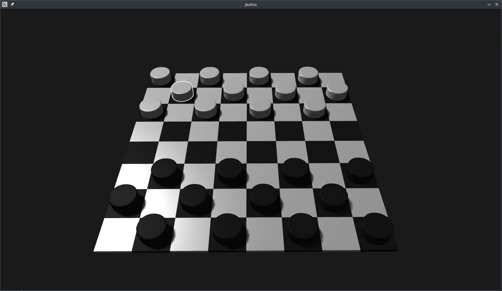
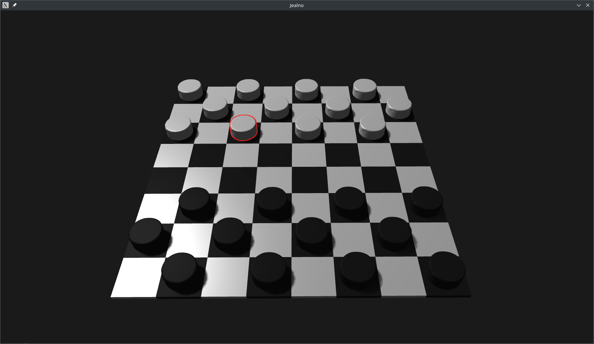
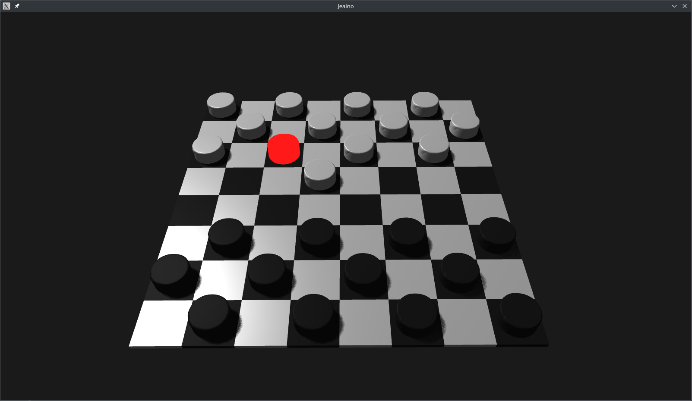
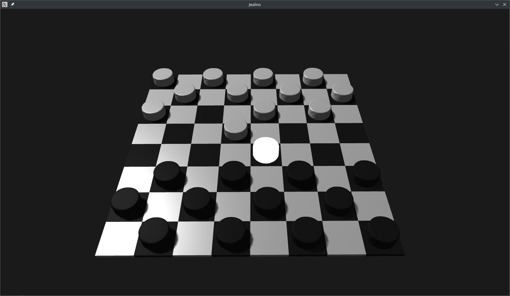

# Jealno - A checkers-like 3D OpenGL-based game

Learned the graphics programming by the 
`Learn OpenGL - Graphics programming` book by `Joey de Vries`. 
That book is truly amazing!

## Screenshots






## Controls

Press buttons q, e, z, c to either select or move a particular chip 
up-left, up-right, down-left, down-right respectively.

## Build

This project requires the libraries `SDL2`, `SDL2_ttf`, `SDL2_image`, `GL`, `GLEW`, `Assimp` 
to be installed on your system before building. Only Linux x86_64 targets are supported.

```shell
mkdir build
cd build
cmake ..
make
chmod +x Jealno
./Jealno
```
